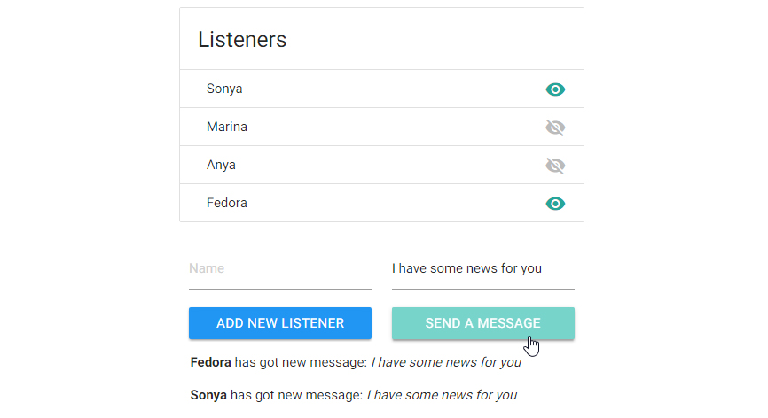

# Observer JS

The tiny js library for manage of events. 
You also can pass some data into event. 
Each different event can have a multiple handlers. 
Available such methods:
- subscribe
- unsubscribe
- publish

#[Demo](https://frentsel.github.io/Observer/index.html)

*Example for use*

```javascript
var observer = new Observer;
var subscriberA = (data) => {
  console.info("Action: subscriberA, data: ", data);
};

var subscriberB = function (data) {
  console.info("Action: subscriberB, data: ", data);
};

// Subscribe on 'Action'
observer.subscribe('Action', subscriberA);
observer.subscribe('Action', subscriberB);
```
*Call 'Action'*
```javascript
observer.publish('Action', Date.now().toString());
```

Expected result in console
```javascript
Action: subscriberA, data:  1485090689876
Action: subscriberB, data:  1485090689876
```

*Unsubscribe subscriberA from 'Action'*
```javascript
observer.unsubscribe('Action', subscriberA);
observer.publish('Action', Date.now().toString());
```
Result in console
```javascript
Action: subscriberB, data:  1485090689879
```